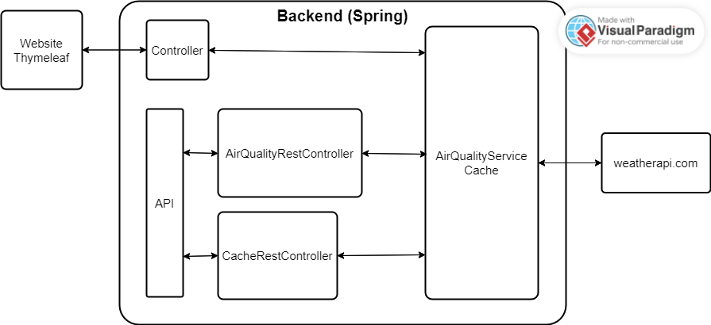

# TQS 2023 HW1 assignment - Air quality web app

Air quality API used: https://www.weatherapi.com/

To run the app, run these 2 command in this folder

```
mvn clean install -DskipTests
mvn spring-boot:run
```

Access home page at http://localhost:8080/

Example API endpoints:<br />
localhost:8080/api/v1/air-quality?city=London&date=2023-04-12<br />
localhost:8080/api/v1/air-quality?city=New York&date=2023-04-13<br />
localhost:8080/api/v1/cache

Note that the free version of weatherapi only retrieves air quality data for today, tomorrow, 2 days from now, and 3 days from now.

Cache information is logged in the terminal.

To run the tests, run this command in this folder

```
mvn test
```

To run the integration tests, run these 2 commands in this folder

```
mvn clean install -DskipTests
mvn failsafe:integration-test
```

<br />

Architecture

