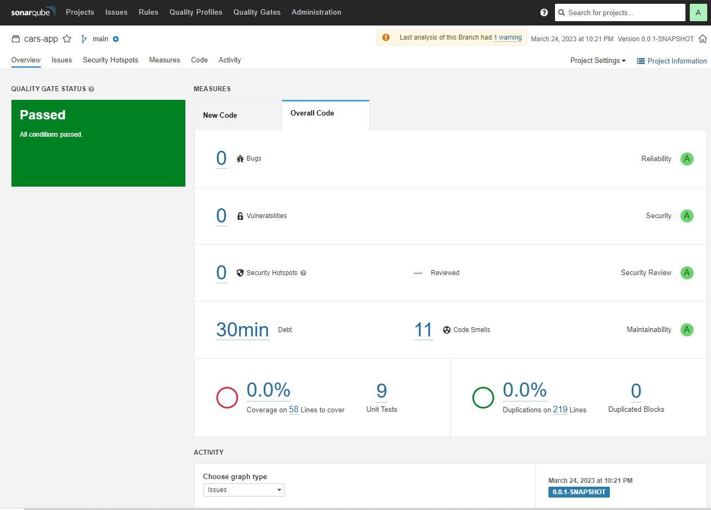
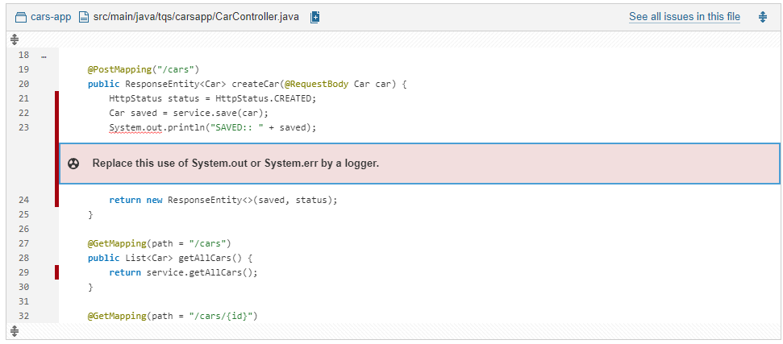
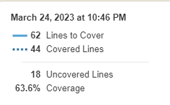
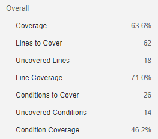

Techincal debt: 30min.

A measure of effort required to fix all code smells raised for the first time on new code.

It is the sum of the technical debt of every code smell in the project.

30mins is the expected amount of time it would take a developer to fix all the code smells.

 

 

 

1 major code smell

 

It's a debug print I forgot to remove. Removed the line and the code smell is gone.

 

Coverage

 

 

