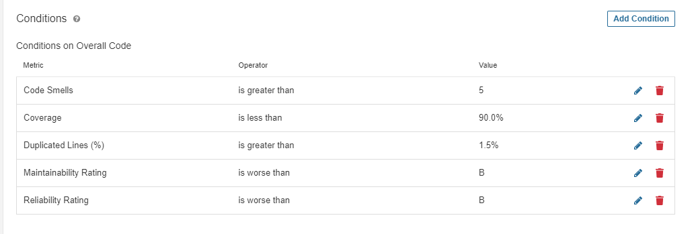
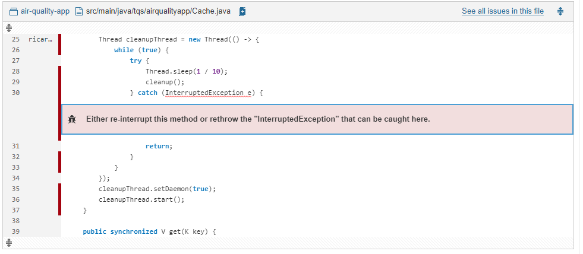
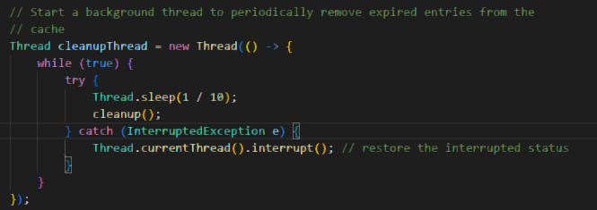
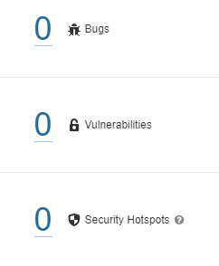
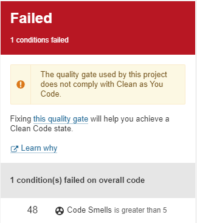

For exercise 6.3, I analyzed my TQS HW1 assignment, an air quality web app.

I defined this quality gate.

 

High coverage (at least 90%) because of TQS's nature and the HW1 assignment objectives.

For the same reason, more than 5 code smells will fail my gate.

Security is not important for this assignment, since TQS is concerned with quality and not security, and because this app will only run in localhost. This means that security related conditions are not needed.

Duplicated lines is also a bad practice that results in lower code quality, so >1.5% duplicated lines will fail my gate.

SonarQube tells me I have 1 bug.

 

Fixing it...

And now no bugs!

However my gate fails because I have too many code smells (48 when I need 5 or less to pass my quality gate)

